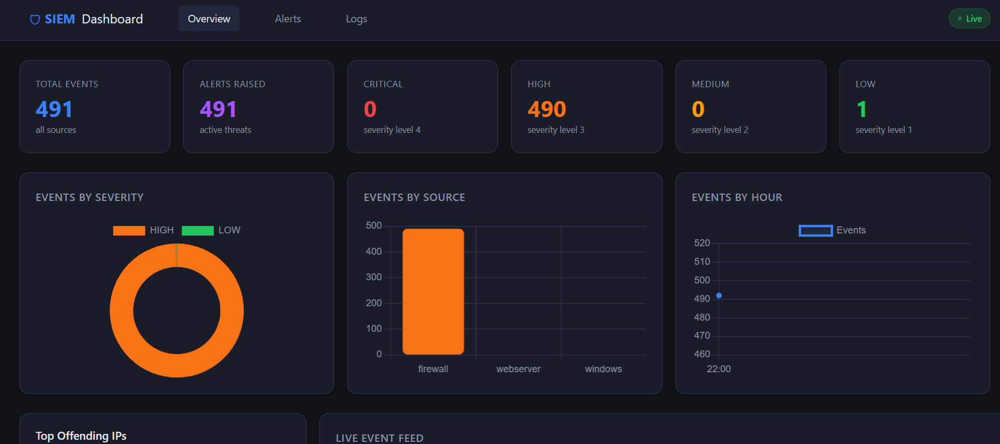

# Aegis: Hybrid SIEM, EDR & SOAR Security Platform

Aegis is a local, multi-threaded **Security Information and Event Management (SIEM)**, **Endpoint Detection and Response (EDR)**, and **Security Orchestration, Automation, and Response (SOAR)** architecture. The application concurrently ingests multi-vector network traffic, enforces file system integrity tracking, and deploys automated local kernel-level firewall countermeasures against active threats.


## 🖥️ Application Interface



---


## 🌟 Key Architecture Pillars

- **SIEM Engine:** Real-time deep packet inspection (via Scapy) and multi-threaded structured log parsing (`Windows Event Logs`, `Linux Syslog`, `Firewall Drops`, and `Web Exploit Patterns`).
- **EDR Component:** Native File Integrity Monitoring (FIM via Watchdog API) guarding critical OS assets like `System32\drivers\etc\hosts`, User Desktops, Application Roaming data, and Windows Startup configurations.
- **SOAR Automation Loop:** An active incident containment handler that intercepts high-severity alerts (`PORT_SCAN`, `WEB_ATTACK`) and orchestrates automated infrastructure mitigation via administrative **Windows Firewall Rules**.

---

## 🛠️ Tech Stack & Dependencies

- **Backend Architecture:** Python 3.10+ (Concurrently orchestrated using thread-safe structures)
- **Web UI & Visualization:** Flask, Jinja2 Template Blocks, HTML5/CSS3 Grid Layouts
- **Storage Layer:** Atomic SQLite Database Engine
- **Telemetry Sensors:** Scapy (Network Sniffer/DPI), Watchdog (Kernel-level File System Listener)
- **Active Response Wrapper:** Windows PowerShell Subprocess Layer

---

## 🚀 Operational Verification & Active Mitigation

When an adversary initiates an attack, Aegis closes the incident lifecycle completely without human intervention:

```text
[ SIEM Network Sensor ] ──> Catching Port Scan Anomaly (192.168.44.112)
           │
           ▼
[ Storage & Pipelines ] ──> Streaming structured log metrics into storage layer
           │
           ▼
[ SOAR Playbook Loop  ] ──> Catching 'Open' High-Severity Threats in SQL Engine
           │
           ▼
[ PowerShell Actions  ] ──> Spawning Administrative Isolation Shells quietly
           │
           ▼
[ Kernel Enforcement  ] ──> New-NetFirewallRule deployed -> Remote Attacker IP Banned
           │
           ▼
[ Dashboard UI View   ] ──> Status field transitions dynamically from "Open" -> "Contained"